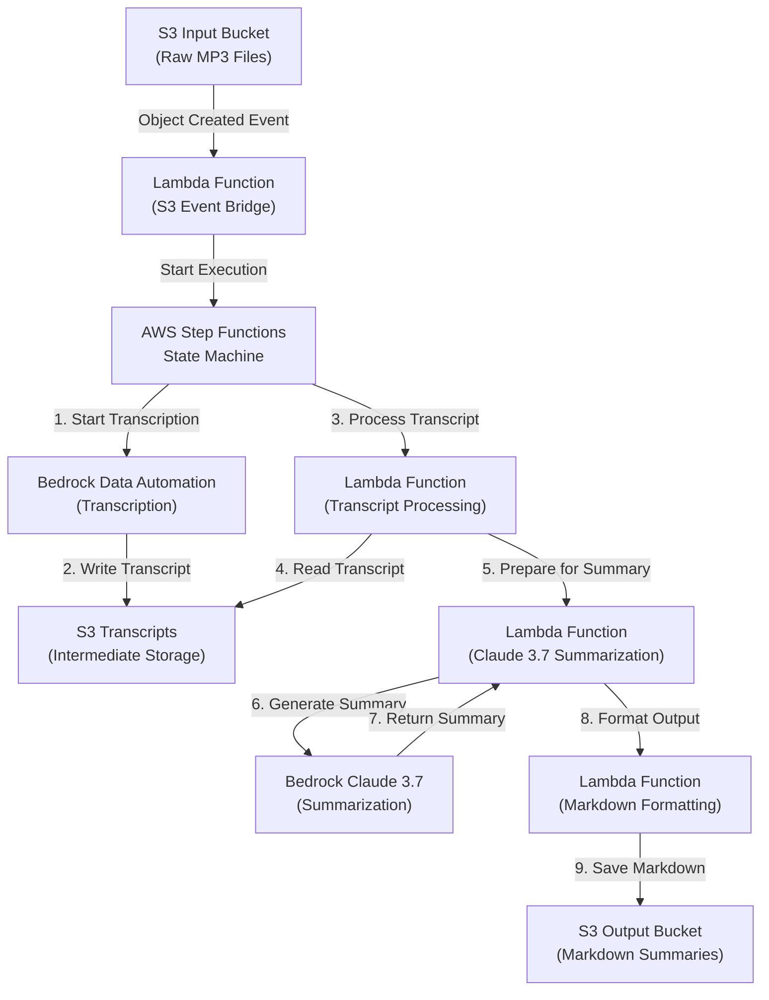

# Podcast Processing Pipeline - Detailed Design

## Project Overview

This document outlines the design for an automated podcast processing pipeline that:

1. Takes MP3 files from an S3 bucket
2. Transcribes them using AWS Bedrock Data Automation
3. Summarizes the transcripts using Claude 3.7 with a custom system prompt
4. Generates structured markdown output with episode details, summary, and actionable insights
5. Stores the results in a designated S3 location

The pipeline is designed to process weekly podcast episodes for "Pop Culture Parenting" hosted by Dr. Billy Garvey and Nick, focusing on parenting topics in the context of films.

## Architecture Diagram



## Infrastructure Stacks

The project is organized into multiple CDK stacks to ensure proper separation of concerns and avoid dependency cycles:

### 1. StorageStack
- Defines all S3 buckets (input, transcripts, and output)
- Contains bucket configurations and lifecycle rules
- Exports bucket references for other stacks

### 2. LambdaStack
- Creates Lambda functions for processing
- References storage resources from StorageStack
- Handles IAM permissions for Lambda functions

### 3. StepFunctionsStack
- Defines the Step Functions state machine
- References Lambda functions from LambdaStack
- Sets up workflow and error handling

### 4. TriggersStack
- Creates the S3 event notification mechanism
- References the state machine from StepFunctionsStack
- References the input bucket from StorageStack
- Bridges S3 events to Step Functions execution

This architecture solves the circular dependency problem by separating triggers from the processing resources they invoke.

## Component Details

### 1. Storage Components

#### S3 Input Bucket
- Purpose: Stores raw MP3 podcast files
- Configuration:
  - Block public access
  - S3-managed encryption
  - Lifecycle rule to expire objects after 30 days (configurable)
  - Event notifications for object creation events

#### S3 Transcripts Bucket
- Purpose: Stores intermediate JSON transcripts
- Configuration:
  - Block public access
  - S3-managed encryption
  - No public access

#### S3 Output Bucket
- Purpose: Stores final markdown summaries
- Configuration:
  - Block public access
  - S3-managed encryption
  - Optional website hosting for viewing summaries

### 2. Processing Components

#### Bedrock Data Automation
- Purpose: Transcribes MP3 files to text
- Configuration:
  - Model: Amazon Titan or other suitable transcription model
  - Output format: JSON with timestamps and speaker identification

#### Claude 3.7 Model
- Purpose: Generates summaries with custom system prompt
- Configuration:
  - Model ID: us.anthropic.claude-3-7-sonnet-20250219-v1:0
  - Max tokens: 4000
  - Temperature: 0.7 (adjustable based on output quality)

#### Lambda Functions

##### Transcript Processor
- Purpose: Prepares transcripts for summarization
- Key functionality:
  - Reads transcript from S3
  - Formats transcript for Claude 3.7
  - Extracts metadata (filename, upload date, etc.)

##### Summarization Function
- Purpose: Calls Claude 3.7 with the system prompt
- Key functionality:
  - Sends transcript to Claude 3.7
  - Applies custom system prompt
  - Processes and structures the response

##### Formatting Function
- Purpose: Creates and formats the final markdown output
- Key functionality:
  - Parses Claude's response
  - Structures content into markdown format
  - Saves to output S3 bucket

### 3. Orchestration

#### Step Functions State Machine
- Purpose: Coordinates the entire workflow
- Key states:
  - TranscribeAudio: Initiates Bedrock Data Automation
  - WaitForTranscription: Polls for completion
  - ProcessTranscript: Invokes transcript processor Lambda
  - GenerateSummary: Invokes summarization Lambda
  - FormatOutput: Invokes formatting Lambda
  - Error handling states for each step

## Implementation Plan

### Project Structure

```
podcast-processor/
├── bin/
│   └── podcast-processor.ts          # Entry point
├── lib/
│   ├── storage-stack.ts              # S3 buckets definition
│   ├── lambda-stack.ts               # Lambda functions
│   ├── bedrock-stack.ts              # Bedrock configuration
│   └── step-functions-stack.ts       # Step Functions workflow
├── src/
│   ├── functions/
│   │   ├── transcript-processor/     # Lambda source code
│   │   ├── summarizer/
│   │   └── formatter/
│   └── step-functions/
│       └── workflow-definition.json  # Step Functions ASL
└── cdk.json                          # CDK configuration
```

### Phase 1: Infrastructure Setup

#### Storage Stack Implementation

```typescript
// lib/storage-stack.ts
import * as cdk from 'aws-cdk-lib';
import * as s3 from 'aws-cdk-lib/aws-s3';
import { Construct } from 'constructs';

export class StorageStack extends cdk.Stack {
  public readonly inputBucket: s3.Bucket;
  public readonly transcriptsBucket: s3.Bucket;
  public readonly outputBucket: s3.Bucket;

  constructor(scope: Construct, id: string, props?: cdk.StackProps) {
    super(scope, id, props);

    // Input bucket for MP3 files
    this.inputBucket = new s3.Bucket(this, 'PodcastInputBucket', {
      blockPublicAccess: s3.BlockPublicAccess.BLOCK_ALL,
      encryption: s3.BucketEncryption.S3_MANAGED,
      lifecycleRules: [
        {
          expiration: cdk.Duration.days(30),
        },
      ],
    });

    // Intermediate storage for transcripts
    this.transcriptsBucket = new s3.Bucket(this, 'TranscriptsBucket', {
      blockPublicAccess: s3.BlockPublicAccess.BLOCK_ALL,
      encryption: s3.BucketEncryption.S3_MANAGED,
    });

    // Output bucket for markdown summaries
    this.outputBucket = new s3.Bucket(this, 'SummariesOutputBucket', {
      blockPublicAccess: s3.BlockPublicAccess.BLOCK_ALL,
      encryption: s3.BucketEncryption.S3_MANAGED,
    });

    // Output for cross-stack references
    new cdk.CfnOutput(this, 'InputBucketName', {
      value: this.inputBucket.bucketName,
      description: 'Name of the input bucket for MP3 files',
    });

    new cdk.CfnOutput(this, 'TranscriptsBucketName', {
      value: this.transcriptsBucket.bucketName,
      description: 'Name of the bucket for transcript storage',
    });

    new cdk.CfnOutput(this, 'OutputBucketName', {
      value: this.outputBucket.bucketName,
      description: 'Name of the output bucket for markdown summaries',
    });
  }
}
```

### Phase 2: Processing Pipeline

#### Lambda Functions Implementation

##### Transcript Processor Lambda

```python
# src/functions/transcript-processor/index.py
import boto3
import json
import os
import re

s3 = boto3.client('s3')
TRANSCRIPTS_BUCKET = os.environ['TRANSCRIPTS_BUCKET']

def handler(event, context):
    # Get the transcript key from the event
    transcript_key = event['transcriptKey']
    original_file_name = event.get('originalFileName', 'unknown.mp3')
    
    # Get the transcript from S3
    response = s3.get_object(
        Bucket=TRANSCRIPTS_BUCKET,
        Key=transcript_key
    )
    
    transcript_data = json.loads(response['Body'].read().decode('utf-8'))
    
    # Process the transcript based on Bedrock Data Automation format
    # This will need to be adjusted based on the actual output format
    full_transcript = ""
    
    # Example processing - actual implementation depends on Bedrock output format
    for segment in transcript_data.get('segments', []):
        speaker = segment.get('speaker', 'Unknown')
        text = segment.get('text', '')
        full_transcript += f"{speaker}: {text}\n\n"
    
    # Extract basic metadata
    metadata = {
        'originalFileName': original_file_name,
        'processingTimestamp': context.invoked_function_arn,
        'transcriptLength': len(full_transcript)
    }
    
    # Return the processed transcript and metadata
    return {
        'transcript': full_transcript,
        'metadata': metadata
    }
```

##### Summarizer Lambda

```python
# src/functions/summarizer/index.py
import boto3
import json
import os

bedrock = boto3.client('bedrock-runtime')
MODEL_ID = 'us.anthropic.claude-3-7-sonnet-20250219-v1:0'

def handler(event, context):
    transcript = event['transcript']
    metadata = event.get('metadata', {})
    
    # System prompt from configuration
    system_prompt = """The follow is a transcript of an audio podcast. The podcast is called Pop Culture Parenting, it is hosted by a Pediatrician (Dr Billy Garvey), and his friend (Nick) who is a parent to young children, but not formally qualified in this domain. Each episode they discuss a topic related to parenting in the context of a film. It has a preamble covering general topics and then provides specific, actionable parenting advice on a given topic. I'd like you to create a a number of outputs.

1) The name of the episode.
2) the film featured in the episode
3) A short summary of the episode, this summary should begin with In this episode Billy and Nick discuss <Topic of episode>, in the context of <Film Name>
4) a single page, easy to consume "cheat sheet" that summarises the advice in the podcast into actional insights, consumable at a glance.
5) 5 search terms that can be used to find the episode. These shouldn't be generic to the podcast, only specific to the topic of the episode."""
    
    # Format user message with transcript
    user_message = f"Here's the podcast transcript to analyze:\n\n{transcript}"
    
    # Create the request for Claude 3.7
    request = {
        "anthropic_version": "bedrock-2023-05-31",
        "max_tokens": 4000,
        "messages": [
            {
                "role": "system",
                "content": system_prompt
            },
            {
                "role": "user",
                "content": user_message
            }
        ]
    }
    
    try:
        # Invoke Claude 3.7
        response = bedrock.invoke_model(
            modelId=MODEL_ID,
            body=json.dumps(request)
        )
        
        response_body = json.loads(response["body"].read())
        summary = response_body["content"][0]["text"]
        
        return {
            "summary": summary,
            "metadata": metadata
        }
        
    except Exception as e:
        print(f"Error invoking Bedrock: {str(e)}")
        raise e
```

##### Formatter Lambda

```python
# src/functions/formatter/index.py
import boto3
import json
import os
import re
from datetime import datetime

s3 = boto3.client('s3')
OUTPUT_BUCKET = os.environ['OUTPUT_BUCKET']

def handler(event, context):
    summary = event['summary']
    metadata = event.get('metadata', {})
    
    # Parse the summary to extract the components
    episode_name = extract_episode_name(summary)
    film = extract_film(summary)
    episode_summary = extract_episode_summary(summary)
    cheat_sheet = extract_cheat_sheet(summary)
    search_terms = extract_search_terms(summary)
    
    # Generate the markdown
    markdown = format_markdown(
        episode_name, 
        film, 
        episode_summary, 
        cheat_sheet, 
        search_terms, 
        metadata
    )
    
    # Generate the output filename
    safe_name = re.sub(r'[^a-zA-Z0-9_-]', '_', episode_name)
    output_key = f"summaries/{safe_name}.md"
    
    # Write to S3
    s3.put_object(
        Bucket=OUTPUT_BUCKET,
        Key=output_key,
        Body=markdown,
        ContentType='text/markdown'
    )
    
    return {
        "status": "success",
        "outputKey": output_key,
        "episodeName": episode_name,
        "film": film
    }

def extract_episode_name(summary):
    pattern = r"1\)\s*(?:The name of the episode:?\s*)?([^\n]+)"
    match = re.search(pattern, summary)
    if match:
        return match.group(1).strip()
    return "Untitled Episode"

def extract_film(summary):
    pattern = r"2\)\s*(?:The film featured in the episode:?\s*)?([^\n]+)"
    match = re.search(pattern, summary)
    if match:
        return match.group(1).strip()
    return "Unknown Film"

def extract_episode_summary(summary):
    pattern = r"3\)\s*(?:A short summary of the episode:?\s*)?(In this episode Billy and Nick discuss.+?)(?=\n\s*4\)|\Z)"
    match = re.search(pattern, summary, re.DOTALL)
    if match:
        return match.group(1).strip()
    return "No summary available."

def extract_cheat_sheet(summary):
    pattern = r"4\)\s*(?:a single page.+?cheat sheet:?\s*)?(.*?)(?=\n\s*5\)|\Z)"
    match = re.search(pattern, summary, re.DOTALL)
    if match:
        return match.group(1).strip()
    return "No cheat sheet available."

def extract_search_terms(summary):
    pattern = r"5\)\s*(?:5 search terms.+?:?\s*)?(.*?)(?=\Z)"
    match = re.search(pattern, summary, re.DOTALL)
    if match:
        terms_text = match.group(1).strip()
        # Extract individual terms, handling different formats
        terms = re.findall(r'["\']([^"\']+)["\']|(?:^|\n)\s*[-•*]?\s*([^,\n]+)(?:,|\n|$)', terms_text)
        # Flatten and clean the list
        flat_terms = [t[0] or t[1] for t in terms if t[0] or t[1]]
        return [term.strip() for term in flat_terms if term.strip()]
    return []

def format_markdown(episode_name, film, episode_summary, cheat_sheet, search_terms, metadata):
    timestamp = datetime.now().strftime("%Y-%m-%d")
    
    # Format search terms as a bulleted list
    search_terms_md = "\n".join([f"- {term}" for term in search_terms])
    
    markdown = f"""# {episode_name}

*Generated: {timestamp}*

## Featured Film
{film}

## Episode Summary
{episode_summary}

## Parenting Cheat Sheet
{cheat_sheet}

## Search Terms
{search_terms_md}
"""
    
    # Add metadata if desired
    if metadata:
        original_file = metadata.get('originalFileName', 'Unknown')
        markdown += f"\n\n---\n*Source: {original_file}*\n"
    
    return markdown
```

#### Step Functions Workflow Definition

```json
{
  "Comment": "Podcast Processing Workflow",
  "StartAt": "TranscribeAudio",
  "States": {
    "TranscribeAudio": {
      "Type": "Task",
      "Resource": "arn:aws:states:::bedrock:invokeDataTransformation",
      "Parameters": {
        "ModelId": "amazon.titan-tg1-large",
        "InputConfig": {
          "S3InputDataConfig": {
            "S3Uri.$": "States.Format('s3://{}/{}', $.bucket, $.key)"
          }
        },
        "OutputConfig": {
          "S3OutputDataConfig": {
            "S3Uri": "${TranscriptsBucket}"
          }
        },
        "JobName.$": "States.Format('Transcribe-{}', $.key)"
      },
      "Next": "WaitForTranscription",
      "Catch": [
        {
          "ErrorEquals": ["States.ALL"],
          "Next": "TranscriptionFailed"
        }
      ]
    },
    "WaitForTranscription": {
      "Type": "Wait",
      "Seconds": 30,
      "Next": "CheckTranscriptionStatus"
    },
    "CheckTranscriptionStatus": {
      "Type": "Task",
      "Resource": "arn:aws:states:::aws-sdk:bedrock:getDataTransformationJob",
      "Parameters": {
        "JobId.$": "$.JobId"
      },
      "Next": "IsTranscriptionComplete",
      "Catch": [
        {
          "ErrorEquals": ["States.ALL"],
          "Next": "TranscriptionFailed"
        }
      ]
    },
    "IsTranscriptionComplete": {
      "Type": "Choice",
      "Choices": [
        {
          "Variable": "$.Status",
          "StringEquals": "COMPLETED",
          "Next": "ProcessTranscript"
        },
        {
          "Variable": "$.Status",
          "StringEquals": "FAILED",
          "Next": "TranscriptionFailed"
        }
      ],
      "Default": "WaitForTranscription"
    },
    "ProcessTranscript": {
      "Type": "Task",
      "Resource": "arn:aws:states:::lambda:invoke",
      "Parameters": {
        "FunctionName": "${TranscriptProcessorFunction}",
        "Payload": {
          "transcriptKey.$": "$.OutputKey",
          "originalFileName.$": "$.key"
        }
      },
      "Next": "GenerateSummary",
      "Catch": [
        {
          "ErrorEquals": ["States.ALL"],
          "Next": "ProcessingFailed"
        }
      ]
    },
    "GenerateSummary": {
      "Type": "Task",
      "Resource": "arn:aws:states:::lambda:invoke",
      "Parameters": {
        "FunctionName": "${SummarizerFunction}",
        "Payload": {
          "transcript.$": "$.Payload.transcript",
          "metadata.$": "$.Payload.metadata"
        }
      },
      "Next": "FormatOutput",
      "Catch": [
        {
          "ErrorEquals": ["States.ALL"],
          "Next": "SummarizationFailed"
        }
      ]
    },
    "FormatOutput": {
      "Type": "Task",
      "Resource": "arn:aws:states:::lambda:invoke",
      "Parameters": {
        "FunctionName": "${FormatterFunction}",
        "Payload": {
          "summary.$": "$.Payload.summary",
          "metadata.$": "$.Payload.metadata"
        }
      },
      "Next": "WorkflowComplete",
      "Catch": [
        {
          "ErrorEquals": ["States.ALL"],
          "Next": "FormattingFailed"
        }
      ]
    },
    "TranscriptionFailed": {
      "Type": "Fail",
      "Error": "TranscriptionError",
      "Cause": "Transcription job failed"
    },
    "ProcessingFailed": {
      "Type": "Fail",
      "Error": "ProcessingError",
      "Cause": "Transcript processing failed"
    },
    "SummarizationFailed": {
      "Type": "Fail",
      "Error": "SummarizationError",
      "Cause": "Summary generation failed"
    },
    "FormattingFailed": {
      "Type": "Fail",
      "Error": "FormattingError",
      "Cause": "Output formatting failed"
    },
    "WorkflowComplete": {
      "Type": "Succeed"
    }
  }
}
```

### Phase 3: CDK Stack Integration

```typescript
// lib/step-functions-stack.ts
import * as cdk from 'aws-cdk-lib';
import * as lambda from 'aws-cdk-lib/aws-lambda';
import * as iam from 'aws-cdk-lib/aws-iam';
import * as s3 from 'aws-cdk-lib/aws-s3';
import * as sfn from 'aws-cdk-lib/aws-stepfunctions';
import * as tasks from 'aws-cdk-lib/aws-stepfunctions-tasks';
import * as s3n from 'aws-cdk-lib/aws-s3-notifications';
import { Construct } from 'constructs';

interface StepFunctionsStackProps extends cdk.StackProps {
  inputBucket: s3.Bucket;
  transcriptsBucket: s3.Bucket;
  outputBucket: s3.Bucket;
}

export class StepFunctionsStack extends cdk.Stack {
  constructor(scope: Construct, id: string, props: StepFunctionsStackProps) {
    super(scope, id, props);

    // Create Lambda functions
    const transcriptProcessor = new lambda.Function(this, 'TranscriptProcessor', {
      runtime: lambda.Runtime.PYTHON_3_9,
      handler: 'index.handler',
      code: lambda.Code.fromAsset('src/functions/transcript-processor'),
      environment: {
        TRANSCRIPTS_BUCKET: props.transcriptsBucket.bucketName,
      },
    });

    const summarizer = new lambda.Function(this, 'Summarizer', {
      runtime: lambda.Runtime.PYTHON_3_9,
      handler: 'index.handler',
      code: lambda.Code.fromAsset('src/functions/summarizer'),
      timeout: cdk.Duration.minutes(5), // Longer timeout for Bedrock API calls
    });

    const formatter = new lambda.Function(this, 'Formatter', {
      runtime: lambda.Runtime.PYTHON_3_9,
      handler: 'index.handler',
      code: lambda.Code.fromAsset('src/functions/formatter'),
      environment: {
        OUTPUT_BUCKET: props.outputBucket.bucketName,
      },
    });

    // Grant permissions
    props.transcriptsBucket.grantRead(transcriptProcessor);
    props.outputBucket.grantWrite(formatter);
    
    // Add Bedrock permissions to summarizer
    summarizer.addToRolePolicy(new iam.PolicyStatement({
      actions: ['bedrock:InvokeModel'],
      resources: ['*'], // Scope this down in production
    }));

    // Create Step Functions state machine
    // (Implementation would include the full state machine definition)
    
    // Set up S3 event notification to trigger the state machine
    props.inputBucket.addEventNotification(
      s3.EventType.OBJECT_CREATED,
      new s3n.SfnStateMachineDestination(stateMachine),
      { prefix: 'uploads/' } // Optional prefix filter
    );
  }
}
```

## System Prompt Configuration

The system prompt for Claude 3.7 is configured as follows:

```
The follow is a transcript of an audio podcast. The podcast is called Pop Culture Parenting, it is hosted by a Pediatrician (Dr Billy Garvey), and his friend (Nick) who is a parent to young children, but not formally qualified in this domain. Each episode they discuss a topic related to parenting in the context of a film. It has a preamble covering general topics and then provides specific, actionable parenting advice on a given topic. I'd like you to create a a number of outputs.

1) The name of the episode.
2) the film featured in the episode
3) A short summary of the episode, this summary should begin with In this episode Billy and Nick discuss <Topic of episode>, in the context of <Film Name>
4) a single page, easy to consume "cheat sheet" that summarises the advice in the podcast into actional insights, consumable at a glance.
5) 5 search terms that can be used to find the episode. These shouldn't be generic to the podcast, only specific to the topic of the episode.
```

This prompt instructs Claude 3.7 to analyze the podcast transcript and generate structured output with:
- Episode name
- Featured film
- Episode summary with a specific format
- A "cheat sheet" of actionable parenting insights
- 5 search terms specific to the episode topic

## Testing & Deployment

### Deployment Process

1. **Initial Setup**:
   ```bash
   npx cdk init app --language typescript
   npm install aws-cdk-lib constructs
   ```

2. **Configure AWS Profile**:
   ```bash
   aws configure
   ```

3. **Bootstrap CDK (if not already done)**:
   ```bash
   npx cdk bootstrap
   ```

4. **Deploy Infrastructure**:
   ```bash
   npx cdk deploy --all
   ```

### Testing Process

1. **Upload Test MP3**:
   ```bash
   aws s3 cp test-podcast.mp3 s3://[input-bucket-name]/uploads/
   ```

2. **Monitor Step Functions Execution**:
   - Check the AWS Step Functions console for workflow execution
   - Review CloudWatch logs for each Lambda function

3. **Verify Output**:
   ```bash
   aws s3 ls s3://[output-bucket-name]/summaries/
   aws s3 cp s3://[output-bucket-name]/summaries/[output-file].md ./
   ```

### Monitoring & Maintenance

- **CloudWatch Alarms**: Set up alarms for Step Functions execution failures
- **Error Handling**: Review and address any errors in CloudWatch Logs
- **Cost Monitoring**: Track Bedrock usage to manage costs

## Future Enhancements

1. **Web Interface**: Create a simple web UI to browse and search summaries
2. **Metadata Extraction**: Extract more metadata from audio files (duration, quality, etc.)
3. **Batch Processing**: Add capability to process multiple files in batch
4. **Custom Vocabulary**: Add domain-specific vocabulary for improved transcription
5. **Multi-language Support**: Add support for podcasts in other languages

## Conclusion

This design document outlines a comprehensive solution for automating the processing of "Pop Culture Parenting" podcast episodes. The solution leverages AWS services including S3, Lambda, Step Functions, and Bedrock to create a scalable, maintainable pipeline that requires minimal manual intervention.

The implementation follows AWS best practices for security and scalability, with appropriate error handling and monitoring. The modular design allows for future enhancements and extensions as requirements evolve.
